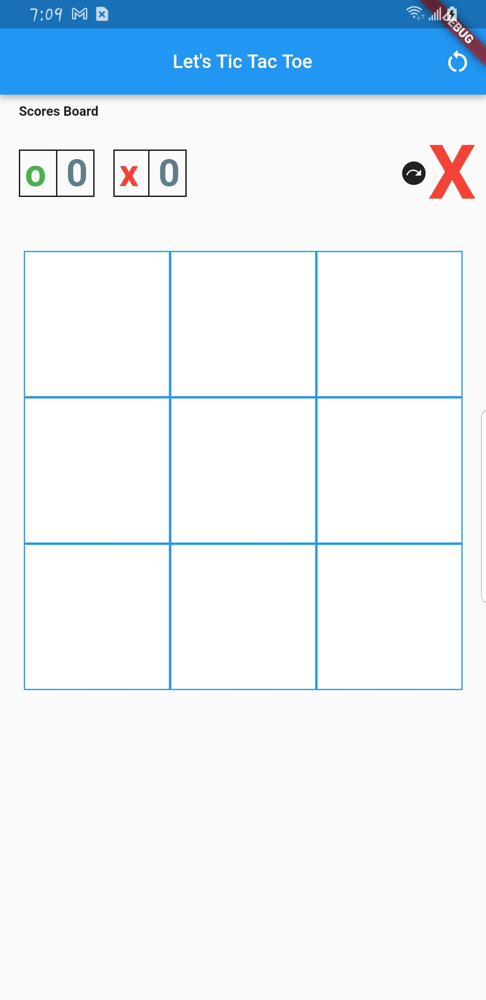
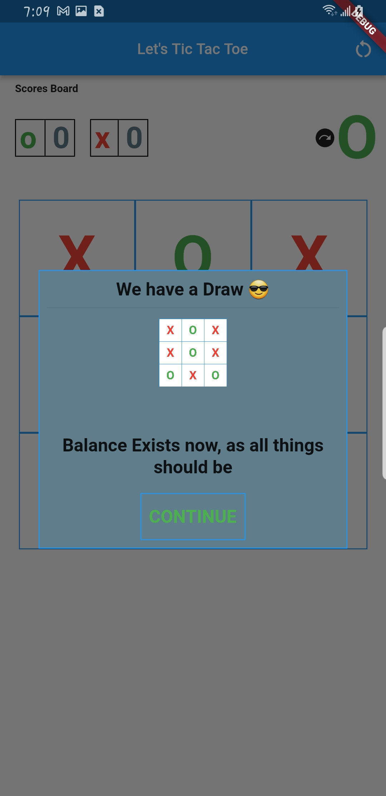
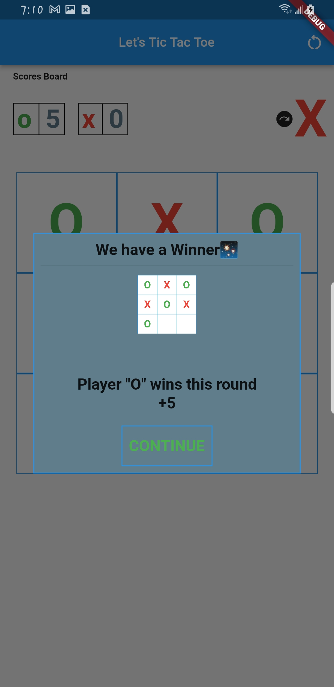

# tic_tac_toe

A simple Tic tac toe game built with Flutter

## Screenshots




## Built With
- Flutter
## Getting Started

To get a local copy up and running follow these simple example steps.

### Prerequisites
- Flutter setup in your local machine


### Setup

- Clone the GitHub Repository
- Go to the Project Directory
- Run ```flutter pub get```
- Run ```flutter run``` to build the app

👤 **Author**

- GitHub: [@Bavon101](https://github.com/Bavon101)
- LinkedIn: [LinkedIn](https://www.linkedin.com/in/akumu-bavon-335416193/)

## Show your support

Give a ⭐️ if you like this project!
